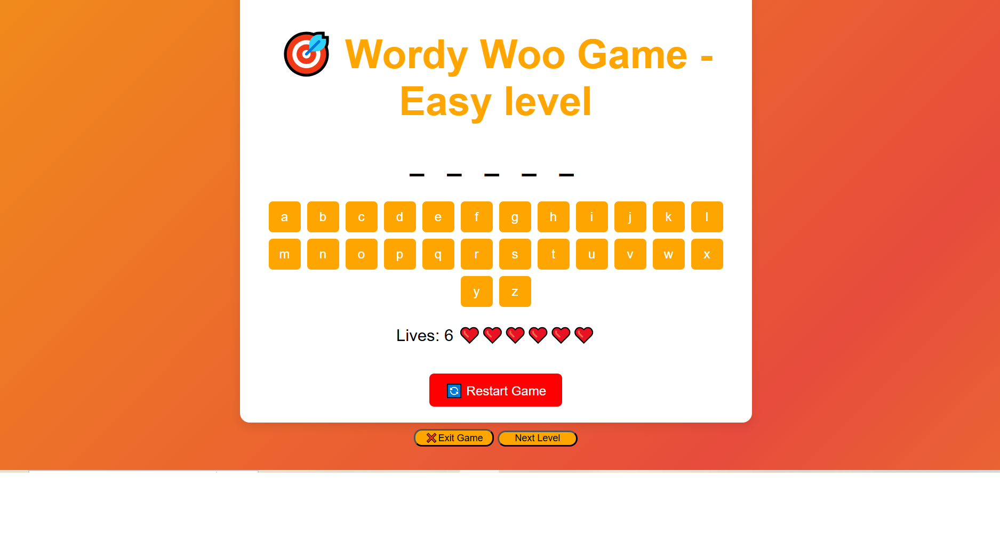

**Project Title:** Interactive Word-Guessing Game: A Digital Implementation of wordy Woo.

**Wordy-Woo-Game:**

This is a simple Wordy-woo-game built using HTML, CSS, and JavaScript. The player tries to guess a hidden word by choosing one letter at a time. The game ends when the player either guesses the word correctly or runs out of allowed attempts.

**Features:**

Fully playable in the browser

Random word selection

Win and lose messages

Simple and responsive design

**How to Use:**

Download or clone this repository.

Open the Home.html file in any web browser.

Start guessing letters to reveal the hidden word.

You win if you guess all the letters correctly before the lives are completed.

**Project Files:**
Home.html
Level.html
Easy.html
Hard.html

**Technologies Used:**

HTML

CSS

JavaScript

No installation or dependencies are required. Just open the HTML file in your browser and play.

**Tool:**
Visual Studio Code

**Screenshots:**

